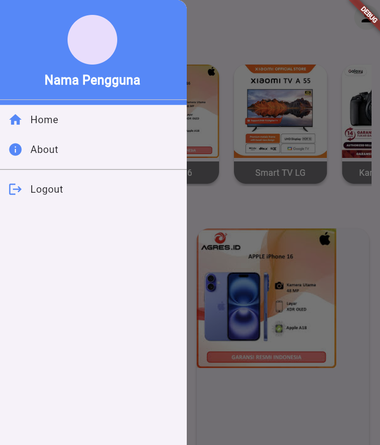

# Tugas Pertemuan 3

Buat Aplikasi dengan flutter yang mengimplementasikan routes, side menu, login, dan local storage. Namun TIDAK BOLEH SAMA PERSIS SEPERTI DI MODUL. Semakin kreatif semakin baik nilainya.

NB : Buat repository baru saja, eg: LabMobile3_Nama_ShiftBaru

Hal yang perlu dikumpulkan :
1. Link Repo berisi Source Code
2. Readme.md yang berisi Penjelasan tiap bagian penting kode dan SS tampilan aplikasi Anda.

Nama : Alfido Mazdan Marsyadi

NIM : H1D022084

Shift Baru: B


file `routerflutter/about_page.dart`
```
import 'package:flutter/material.dart';
import 'package:pertemuan3/router_flutter/side_menu.dart';

class AboutPage extends StatelessWidget {
  const AboutPage({super.key});

  @override
  Widget build(BuildContext context) {
    return Scaffold(
      appBar: AppBar(
        title: const Text('About Page'),
      ),
      drawer: const Sidemenu(),
      body: ListView(
        padding: const EdgeInsets.all(20),
        children: [
          // Header Gambar
          Container(
            height: 500,
            width: 500,
            decoration: BoxDecoration(
              borderRadius: BorderRadius.circular(20),
              image: const DecorationImage(
                image: AssetImage('logo.png'), // Ubah gambar sesuai dengan tema jual beli
                fit: BoxFit.cover,
              ),
            ),
          ),

          const SizedBox(height: 20),
          // Judul Aplikasi
          const Text(
            'JASON STORE',
            style: TextStyle(
              fontSize: 28,
              fontWeight: FontWeight.bold,
              color: Colors.black,
            ),
            textAlign: TextAlign.center,
          ),
          const SizedBox(height: 10),
          // Deskripsi Aplikasi
          const Text(
            'Aplikasi ini memudahkan kamu untuk menjual dan membeli barang secara online dengan aman, cepat, dan nyaman.',
            style: TextStyle(
              fontSize: 16,
              color: Colors.black87,
            ),
            textAlign: TextAlign.center,
          ),
          const SizedBox(height: 20),
          // Fitur Aplikasi
          const Text(
            'Fitur Utama:',
            style: TextStyle(
              fontSize: 20,
              fontWeight: FontWeight.bold,
              color: Colors.black,
            ),
          ),
          const SizedBox(height: 10),
          // List Fitur
          const ListTile(
            leading: Icon(Icons.shopping_cart, color: Colors.green),
            title: Text('Jual produk dengan mudah'),
          ),
          const ListTile(
            leading: Icon(Icons.search, color: Colors.blue),
            title: Text('Cari barang yang kamu butuhkan'),
          ),
          const ListTile(
            leading: Icon(Icons.payment, color: Colors.orange),
            title: Text('Metode pembayaran yang aman dan fleksibel'),
          ),
          const ListTile(
            leading: Icon(Icons.local_shipping, color: Colors.red),
            title: Text('Pengiriman cepat dan aman'),
          ),
          const SizedBox(height: 20),
          // Footer
          const Text(
            'Terima kasih telah menggunakan aplikasi jual beli kami. Kami berharap pengalaman belanja kamu menyenangkan!',
            style: TextStyle(
              fontSize: 16,
              color: Colors.black54,
            ),
            textAlign: TextAlign.center,
          ),
        ],
      ),
    );
  }
}


```
Scaffold: Struktur dasar halaman di Flutter. Di sini kita menggunakan Scaffold untuk menyediakan AppBar di bagian atas, Drawer (sidemenu), dan body untuk konten utama.
AppBar: Menampilkan judul "About Page" di bagian atas layar.
Drawer: Menggunakan komponen Sidemenu yang sudah didefinisikan untuk menampilkan navigasi samping (side menu).
ListView: Menyusun konten utama halaman dalam bentuk daftar vertikal yang bisa di-scroll. Digunakan padding sebesar 20 untuk memberi jarak pada setiap elemen dari tepi layar.
Container: Digunakan untuk menampilkan gambar pada halaman About.
height & width: Mengatur tinggi dan lebar dari gambar.
BoxDecoration: Menambahkan dekorasi seperti radius untuk sudut (melalui borderRadius) dan gambar latar.
DecorationImage: Mengambil gambar dari AssetImage('logo.png') dan menyesuaikannya dengan ukuran kotak menggunakan BoxFit.cover agar gambar memenuhi seluruh kotak.
Text: Menampilkan teks "JASON STORE" sebagai judul aplikasi.
TextStyle: Mengatur ukuran teks (fontSize: 28), menebalkan teks (fontWeight: FontWeight.bold), dan warna teks (color: Colors.black).
Struktur utama: Menggunakan ListView untuk menampilkan konten dalam daftar vertikal yang di-scroll.
Desain gambar: Menggunakan Container dengan dekorasi gambar untuk membuat header yang menarik.
Konten teks: Teks dijelaskan dengan penataan ukuran, warna, dan gaya untuk meningkatkan estetika.
Fitur aplikasi: Ditampilkan dalam bentuk ListTile untuk memberikan tata letak yang terstruktur dengan ikon di sebelah kiri dan deskripsi fitur di sebelah kanan.

file `router_flutter/home_page.dart`
```
import 'package:flutter/material.dart';
import '/router_flutter/side_menu.dart';
import 'package:shared_preferences/shared_preferences.dart';

class HomePage extends StatefulWidget {
  const HomePage({Key? key}) : super(key: key);

  @override
  _HomePageState createState() => _HomePageState();
}

class _HomePageState extends State<HomePage> {
  var namauser;

  // Simulasi data produk untuk tampilan grid dan list
  final List<Map<String, String>> products = [
    {"title": "Laptop ASUS", "image": "laptop.jpg"},
    {"title": "Iphone 16", "image": "iphone.jpg"},
    {"title": "Smart TV LG", "image": "smarttv.jpg"},
    {"title": "Kamera Canon", "image": "kameracanon.jpg"},
    {"title": "Keyboard Gaming", "image": "keyboard.jpg"},
  ];

  @override
  void initState() {
    super.initState();
    _loadUsername();
  }

  void _loadUsername() async {
    SharedPreferences prefs = await SharedPreferences.getInstance();
    namauser = prefs.getString('username');
    setState(() {});
  }

  @override
  Widget build(BuildContext context) {
    return Scaffold(
      appBar: AppBar(
        title: const Text('HomePage'),
        actions: [
          Padding(
            padding: const EdgeInsets.all(8.0),
            child: CircleAvatar(
              backgroundColor: Colors.grey[200],
              child: const Icon(Icons.person, color: Colors.black),
            ),
          ),
        ],
      ),
      drawer: const Sidemenu(),
      body: ListView(
        padding: const EdgeInsets.all(20),
        children: [
          const Text(
            'Produk Populer',
            style: TextStyle(fontSize: 24, fontWeight: FontWeight.bold),
          ),
          const SizedBox(height: 10),
          SizedBox(
            height: 200,
            child: ListView.builder(
              scrollDirection: Axis.horizontal,
              itemCount: products.length,
              itemBuilder: (context, index) {
                return Padding(
                  padding: const EdgeInsets.symmetric(horizontal: 8),
                  child: Card(
                    elevation: 4,
                    shape: RoundedRectangleBorder(
                      borderRadius: BorderRadius.circular(20),
                    ),
                    child: ClipRRect(
                      borderRadius: BorderRadius.circular(20),
                      child: Stack(
                        children: [
                          Image.asset(
                            products[index]["image"]!,
                            fit: BoxFit.cover,
                            width: 150,
                          ),
                          Positioned(
                            bottom: 0,
                            left: 0,
                            right: 0,
                            child: Container(
                              color: Colors.black54,
                              padding: const EdgeInsets.all(8),
                              child: Text(
                                products[index]["title"]!,
                                style: const TextStyle(color: Colors.white),
                                textAlign: TextAlign.center,
                              ),
                            ),
                          ),
                        ],
                      ),
                    ),
                  ),
                );
              },
            ),
          ),
          const SizedBox(height: 20),
          const Text(
            'Rekomendasi untuk Anda',
            style: TextStyle(fontSize: 24, fontWeight: FontWeight.bold),
          ),
          const SizedBox(height: 10),
          GridView.builder(
            shrinkWrap: true,
            physics: const NeverScrollableScrollPhysics(),
            itemCount: products.length,
            gridDelegate: const SliverGridDelegateWithFixedCrossAxisCount(
              crossAxisCount: 2,
              mainAxisSpacing: 10,
              crossAxisSpacing: 10,
              childAspectRatio: 0.6, // Ubah rasio aspek agar gambar lebih kecil
            ),
            itemBuilder: (context, index) {
              return GestureDetector(
                onTap: () {
                  // Fungsi untuk detail produk
                },
                child: Card(
                  elevation: 4,
                  shape: RoundedRectangleBorder(
                    borderRadius: BorderRadius.circular(20),
                  ),
                  child: ClipRRect(
                    borderRadius: BorderRadius.circular(20),
                    child: Stack(
                      children: [
                        Image.asset(
                          products[index]["image"]!,
                          fit: BoxFit.cover,
                        ),
                        Positioned(
                          bottom: 0,
                          left: 0,
                          right: 0,
                          child: Container(
                            color: Colors.black54,
                            padding: const EdgeInsets.all(8),
                            child: Text(
                              products[index]["title"]!,
                              style: const TextStyle(color: Colors.white),
                              textAlign: TextAlign.center,
                            ),
                          ),
                        ),
                      ],
                    ),
                  ),
                ),
              );
            },
          ),
        ],
      ),
    );
  }
}


```
HomePage: Sebuah kelas yang mewakili halaman utama aplikasi. Karena state-nya dapat berubah (misalnya, nama pengguna bisa diambil dari SharedPreferences), halaman ini dibuat sebagai StatefulWidget.
_HomePageState: State dari HomePage yang mengatur perubahan data atau tampilan saat state berubah.
Scaffold: Struktur dasar halaman yang menyediakan AppBar, drawer (menu samping), dan body untuk konten halaman.
AppBar: Bar di bagian atas yang berisi judul halaman ("HomePage") dan ikon akun pengguna berbentuk CircleAvatar di sebelah kanan.
Sidemenu: Menu samping yang diambil dari komponen Sidemenu yang sudah Anda buat.
Text: Menampilkan judul bagian "Produk Populer" dengan font besar dan tebal.
ListView.builder: Membuat daftar produk yang dapat di-scroll secara horizontal. Masing-masing item adalah Card yang berisi gambar produk dan judulnya yang ditampilkan pada bagian bawah menggunakan Stack dan Positioned.
_loadUsername: Fungsi untuk mengambil nama pengguna dari SharedPreferences (tempat penyimpanan lokal) dan menyimpannya ke dalam variabel namauser. Setelah data diambil, setState dipanggil agar UI dapat di-update dengan nama pengguna yang diperoleh.
GridView.builder: Menyusun produk dalam grid dengan 2 kolom. Item produk diatur agar tidak dapat di-scroll karena NeverScrollableScrollPhysics digunakan, sehingga GridView akan tetap mengikuti panjang konten halaman.

file `router_flutter/login_page.dart`
```
import 'package:flutter/material.dart';
import 'package:shared_preferences/shared_preferences.dart';
import '/router_flutter/home_page.dart';

class LoginPage extends StatefulWidget {
  const LoginPage({super.key});

  @override
  _LoginPageState createState() => _LoginPageState();
}

class _LoginPageState extends State<LoginPage> {
  final TextEditingController _usernameController = TextEditingController();
  final TextEditingController _passwordController = TextEditingController();

  void _saveUsername() async {
    SharedPreferences prefs = await SharedPreferences.getInstance();
    prefs.setString('username', _usernameController.text);
  }

  Widget _buildInputField({
    required TextEditingController controller,
    required String placeholder,
    bool isPassword = false,
  }) {
    return Padding(
      padding: const EdgeInsets.symmetric(vertical: 10.0),
      child: TextField(
        controller: controller,
        obscureText: isPassword,
        decoration: InputDecoration(
          filled: true,
          fillColor: Colors.grey[200],
          hintText: placeholder,
          border: OutlineInputBorder(
            borderSide: BorderSide.none,
            borderRadius: BorderRadius.circular(15.0),
          ),
        ),
      ),
    );
  }

  void _showDialog(String message, Widget page) {
    showDialog(
      context: context,
      builder: (context) {
        return AlertDialog(
          title: Text(
            message,
            style: const TextStyle(
              color: Colors.black54,
              fontWeight: FontWeight.bold,
            ),
          ),
          actions: [
            TextButton(
              onPressed: () {
                Navigator.push(
                  context,
                  MaterialPageRoute(builder: (context) => page),
                );
              },
              child: const Text(
                'OK',
                style: TextStyle(
                  color: Colors.black,
                  fontWeight: FontWeight.bold,
                ),
              ),
            ),
          ],
        );
      },
    );
  }

  @override
  Widget build(BuildContext context) {
    return Scaffold(
      backgroundColor: Colors.white,
      body: ListView(
        padding: const EdgeInsets.symmetric(horizontal: 20, vertical: 50),
        children: [
          // Bagian ikon login di atas tulisan "Login"
          Center(
            child: Column(
              children: [
                const Icon(
                  Icons.person,
                  size: 100,
                  color: Colors.blueAccent, // Ubah warna sesuai kebutuhan
                ),
                const SizedBox(height: 20),
                const Text(
                  'Login',
                  style: TextStyle(
                    fontSize: 32,
                    fontWeight: FontWeight.bold,
                    color: Colors.black87,
                  ),
                ),
              ],
            ),
          ),
          const SizedBox(height: 20),
          const Text(
            'Welcome Back!',
            style: TextStyle(
              fontSize: 22,
              fontWeight: FontWeight.w600,
              color: Colors.black87,
            ),
            textAlign: TextAlign.center,
          ),
          const SizedBox(height: 20),
          // Input field untuk username
          _buildInputField(
            controller: _usernameController,
            placeholder: 'Username',
          ),
          // Input field untuk password
          _buildInputField(
            controller: _passwordController,
            placeholder: 'Password',
            isPassword: true,
          ),
          const SizedBox(height: 20),
          // Tombol login
          ElevatedButton(
            onPressed: () {
              if (_usernameController.text == 'admin' &&
                  _passwordController.text == 'alfido1234') {
                _saveUsername();
                _showDialog('Login Successful!', const HomePage());
              } else {
                _showDialog('Incorrect Username or Password', const LoginPage());
              }
            },
            style: ElevatedButton.styleFrom(
              backgroundColor: Colors.blueAccent,
              padding: const EdgeInsets.symmetric(vertical: 15),
              shape: RoundedRectangleBorder(
                borderRadius: BorderRadius.circular(15),
              ),
            ),
            child: const Text(
              'Login',
              style: TextStyle(
                fontSize: 18,
                color: Colors.white,
              ),
            ),
          ),
          const SizedBox(height: 15),
          // Link forgot password
          Center(
            child: TextButton(
              onPressed: () {
                // Implementasikan fungsi forgot password di sini
              },
              child: const Text(
                'Forgot Password?',
                style: TextStyle(
                  color: Colors.black,
                  fontWeight: FontWeight.w600,
                ),
              ),
            ),
          ),
        ],
      ),
    );
  }
}


```
LoginPage: Halaman login dibuat menggunakan StatefulWidget karena kita ingin menyimpan dan memperbarui state (seperti input username dan password).
_LoginPageState: Mengelola state dari halaman login, seperti mengontrol input dan validasi login.
TextEditingController: Mengelola teks input dari field username dan password.
_saveUsername: Fungsi ini menyimpan username yang dimasukkan oleh pengguna ke dalam SharedPreferences sebagai data lokal permanen.
SharedPreferences: Digunakan untuk menyimpan data secara lokal di perangkat (misalnya username), sehingga data tetap tersimpan walaupun aplikasi di-restart.
_buildInputField: Fungsi yang digunakan untuk membangun field input (untuk username dan password). Field ini memiliki properti opsional isPassword, yang jika bernilai true, teks akan disembunyikan (obscureText) untuk melindungi password.
TextField: Komponen input di Flutter, digunakan untuk menerima teks dari pengguna.
InputDecoration: Menyesuaikan tampilan input field seperti warna latar belakang, placeholder, dan bentuk border.
_showDialog: Menampilkan pesan dalam bentuk pop-up (dialog). Pesan yang ditampilkan berupa teks dengan tombol "OK" yang membawa pengguna ke halaman yang ditentukan (misalnya HomePage setelah login sukses).
showDialog: Fungsi bawaan Flutter untuk menampilkan dialog modals.
AlertDialog: Komponen yang digunakan untuk menampilkan dialog sederhana dengan teks dan tombol aksi.
Center: Menampilkan konten di tengah-tengah layar (ikon login dan teks "Login").
Icon: Menampilkan ikon person yang besar dengan warna biru, merepresentasikan halaman login.
Text: Menampilkan judul dan subjudul halaman dengan gaya teks yang tebal dan besar.

file `router_flutter/side_menu.dart`
```
import 'package:flutter/material.dart';
import 'package:pertemuan3/router_flutter/home_page.dart';
import 'about_page.dart';
import 'package:shared_preferences/shared_preferences.dart';
import 'login_page.dart';

class Sidemenu extends StatelessWidget {
  const Sidemenu({Key? key}) : super(key: key);

  Future<void> _logout(BuildContext context) async {
    SharedPreferences prefs = await SharedPreferences.getInstance();
    await prefs.clear();
    Navigator.of(context).pushReplacementNamed('/login');
  }

  @override
  Widget build(BuildContext context) {
    return Drawer(
      child: ListView(
        children: [
          Container(
            color: Colors.blueAccent,
            child: const DrawerHeader(
              decoration: BoxDecoration(
                color: Colors.blueAccent,
              ),
              child: Column(
                mainAxisAlignment: MainAxisAlignment.center,
                children: [
                  CircleAvatar(
                    radius: 40,
                    backgroundImage: AssetImage('assets/profile.jpg'), // Ganti dengan gambar profil Anda
                  ),
                  SizedBox(height: 10),
                  Text(
                    'Nama Pengguna', // Ganti dengan nama pengguna
                    style: TextStyle(
                      color: Colors.white,
                      fontSize: 20,
                      fontWeight: FontWeight.bold,
                    ),
                  ),
                ],
              ),
            ),
          ),
          ListTile(
            leading: const Icon(Icons.home, color: Colors.blueAccent),
            title: const Text('Home'),
            onTap: () {
              Navigator.push(
                context,
                MaterialPageRoute(
                  builder: (context) => const HomePage(),
                ),
              );
            },
          ),
          ListTile(
            leading: const Icon(Icons.info, color: Colors.blueAccent),
            title: const Text('About'),
            onTap: () {
              Navigator.push(
                context,
                MaterialPageRoute(
                  builder: (context) => const AboutPage(),
                ),
              );
            },
          ),
          const Divider(
            thickness: 1,
            color: Colors.grey,
          ),
          ListTile(
            leading: const Icon(Icons.logout, color: Colors.blueAccent),
            title: const Text('Logout'),
            onTap: () {
              _logout(context);
            },
          ),
        ],
      ),
    );
  }
}


```
Sidemenu adalah widget Stateless yang menampilkan tampilan menu samping. Class ini bersifat stateless karena tidak menyimpan state yang bisa berubah.
_logout: Fungsi asinkron untuk logout. Fungsi ini membersihkan data yang disimpan di SharedPreferences, dan setelah itu navigasi ke halaman login dengan menggantikan halaman yang sedang aktif menggunakan pushReplacementNamed('/login').
Container: Memiliki background biru dan digunakan untuk header drawer.
DrawerHeader: Ini adalah header di bagian atas drawer yang berisi CircleAvatar untuk gambar profil, dan teks untuk nama pengguna.
CircleAvatar: Menampilkan gambar profil (dalam hal ini assets/profile.jpg).
Text: Menampilkan "Nama Pengguna". Di dalam aplikasi nyata, ini akan digantikan dengan nama pengguna sebenarnya.
ListTile: Menampilkan item menu dengan ikon dan teks.
leading: Ikon yang ditampilkan di sebelah kiri (ikon home untuk menuju halaman Home).
title: Teks yang akan ditampilkan (dalam hal ini “Home”).
onTap: Saat di-tap, akan menavigasi ke halaman HomePage menggunakan Navigator.push.


file `mian.dart`
```
import 'package:flutter/material.dart';
import 'router_flutter/login_page.dart';
import 'router_flutter/home_page.dart'; // Pastikan untuk mengimpor halaman home
import 'router_flutter/about_page.dart'; // Pastikan untuk mengimpor halaman about

void main() {
  runApp(const MyApp());
}

class MyApp extends StatelessWidget {
  const MyApp({super.key});

  @override 
  Widget build(BuildContext context) {
    return MaterialApp(
      title: 'Flutter Menu',
      initialRoute: '/', // Rute awal
      routes: {
        '/': (context) => const LoginPage(), // Halaman login
        '/home': (context) => const HomePage(), // Halaman home
        '/about': (context) => const AboutPage(), // Halaman about
      },
    );
  }
}


```

Imports
Mengimpor package:flutter/material.dart, yang merupakan paket utama untuk membangun antarmuka pengguna di Flutter.
Mengimpor LoginPage, HomePage, dan AboutPage dari folder router_flutter, yang merupakan halaman-halaman yang akan dinavigasi dalam aplikasi.
Fungsi Main
void main() adalah titik masuk aplikasi. Di sini, aplikasi diinisialisasi dengan menjalankan MyApp.
runApp(const MyApp()) memulai aplikasi Flutter dengan widget MyApp.
Kelas MyApp
MyApp adalah kelas yang merupakan turunan dari StatelessWidget, yang berarti tidak memiliki state yang bisa berubah.
Kelas ini bertanggung jawab untuk mengonfigurasi aplikasi dan menyusun widget utama.
Metode Build
Metode build membangun struktur antarmuka pengguna aplikasi.
Menggunakan MaterialApp, yang menyediakan desain material dan beberapa fungsionalitas dasar aplikasi.
Properti MaterialApp
title: Mengatur judul aplikasi, yang akan ditampilkan di bilah tugas atau ikon aplikasi.
initialRoute: Menentukan rute awal aplikasi saat pertama kali diluncurkan. Dalam hal ini, ditetapkan ke '/', yang berarti aplikasi akan menampilkan LoginPage sebagai halaman awal. 
Rute Aplikasi
routes: Mendefinisikan peta rute untuk aplikasi.
'/': Menunjuk pada LoginPage. Ini adalah halaman pertama yang ditampilkan saat aplikasi diluncurkan.
'/home': Menunjuk pada HomePage, yang akan diakses ketika pengguna berhasil login.
'/about': Menunjuk pada AboutPage, yang dapat diakses dari menu atau navigasi dalam aplikasi.

## Screenshot
Contoh :





